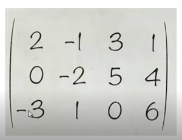
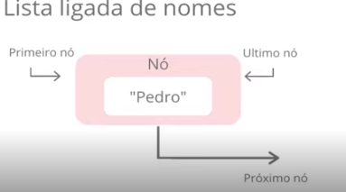
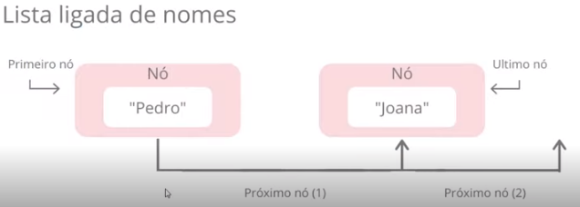
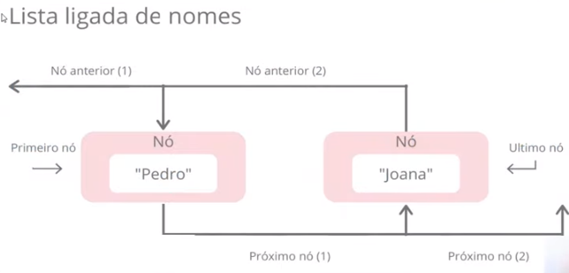
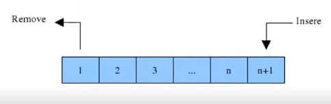
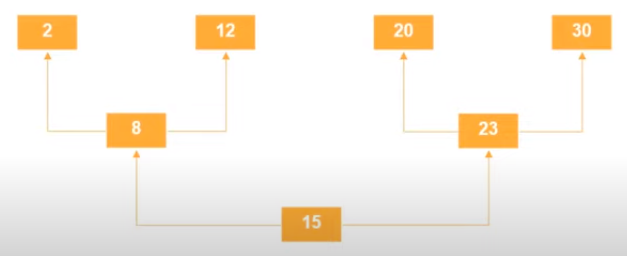
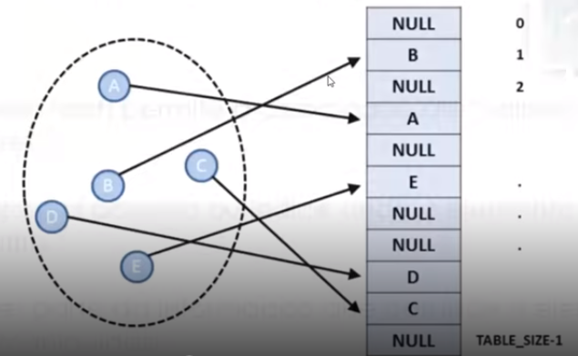
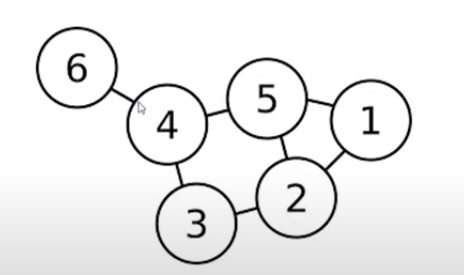

# Estrutura de Dados e Algorítmos

## O que é estrutura de dados?

Estrutura organizada de dados em memória, para que possam ser usados corretamente. Pense como um esqueleto de como os dados serão dispostos na memória ou armazenamento do dispositivo.

Há muitas aplicações no desenvolvimento de sistemas. Com algorítmos e estrutura adequados, tem como trabalhar com quantidades muito grandes de dados, de forma otimizada.

## Algorítmo

Conjunto de instruções estruturadas e ordenadas, para realizar tarefas/operações específicas. Um ''rítmo'' organizado de algo, para que sirvam para resolver problemas.

Na Estrutura de Dados, os algorítmos são usados para manipulação  dos dados, como inserir, excluir, procurar e ordenar dados.

Numa estrutura como essa, precisamos saber como fazer certas operações básicas:

Inserir, excluir dados, localizar algum elemento, classificar dados, consultar todos os itens da estrutura.

## Vetores e Matrizes (Arrays)

Como os arrays nas linguagens de programação.

São estruturas que podem armazenar muitas variáveis de um mesmo tipo em um algorítmo.

Sugeriu o Portugol Studio na web. [Portugol Webstudio](https://portugol-webstudio.cubos.io/ide)

Pra que declarar variáveis uma a uma de um mesmo tipo, se podemos usar os arrays? Fica mais fácil de se trabalhar.

### Vetores

Vetores são indexados, ou seja, é ordenado ''podemos dizer, como uma folha de caderno'' - há várias linhas e cada linha você pode armazenar qualquer texto por exemplo.

Unidimensional armazenam variáveis de mesmo tipo (a grosso modo, ''tem uma coluna só mas tem várias linhas'').

Ele dá como exemplo um bloco de montar de brinquedo.

Lembrando: arrays sempre têm o índice inicial sendo zero.

### Matrizes

Matriz ou array multi-dimensional é um vetor de vetores. Pense numa planilha de Excel, ou num cubo mágico, por exemplo. Há várias linhas e várias colunas.

Matrizes têm duas ou mais dimensões.

]

### Registros

São estruturas que fornecem um formato específico para armazenar os dados.

Os arrays permitem armazenar de um único tipo. Você declara um array, mas já coloca lá um tipo, como inteiro, string, etc. O array todo vai ter dados só daquele tipo armazenados.

Já os registros permitem armazenar mais de um tipo.

Pensa como um cadastro de um cliente. Tem tanto strings, quanto números, datas, etc.

Toda estrutura de registro tem um nome e cada campo pode ser acessado usando o ponto final (.).

Exemplo de uma estrutura chamada ''livro'', podemos acessar o preço da seguinte forma: *livro.preco*

Exemplo de um algorítmo, usando estrutura:

    ALGORITMO

    tipo

    //declaração da estrutura

    estrutura_livro = registro

    nome: caractere

    preco: real

    pagina: inteiro

    fimregistro

    //declaração das variáveis

    i inteiro

    livro array[1..3] de estrutura_livro

    escreva("Entre com os nomes, preços e números de páginas de três livros: \n")

    para i de 1 ate 3 faca

        leia(livro[i].nome, livro[i].preco, livro[i].paginas)

    fimpara

    escreva("Esses foram os dados digitados: \n")

    para ide 1 ate 3 faca

        escreva(livro[i].nome, livro[i].preco, livro[i].paginas)

    fimpara

    FIMALGORITMO

## O que são Listas, Pilhas e Filas

### Listas

Listas têm tamanho ajustável. São diferentes de arrays. Estas últimas são tamanho fixo.

Há dois tipos de listas: ligadas e duplamente ligadas

#### Lista Ligada

Na lista ligada, há nós, que identificam o valor salvo nele e o valor posterior a ele.

Conforme vai adicionando elementos,  a lista varia de tamanho, a quantidade de nós vai aumentando.

Exemplos de lista ligada:

]

#### Lista Duplamente Ligada

Listas duplamente ligadas permitem ''navegar para trás'' ou seja, as listas ligadas somente sabem qual o elemento seguinte, enquanto as duplamente ligadas conseguem identificar o elemento anterior e também o posterior.

Lista ligada é linear, sequencial, enquanto a duplamente pode ser um pouco menos linear e pode ou não ser sequencial.

Exemplo de lista duplamente ligada:

### Pilhas

Como no Magic, ou uma pilha de livros, que são LIFO. Último a entrar, primeiro a sair.

Só permite acessar um item de dados armazenado. Como no Magic mesmo também nesse ponto, somente se tem acesso a mágica do topo da pilha e somente uma por vez.

Tipos de Pilhas: LIFO (ou UEPS) / FIFO (ou PEPS)

LIFO = Last In/First Out

FIFO = First In/First Out

Batches seriam FIFO?

### Filas

Nas filas, o elemento mais antigo armazenado na fila é o primeiro a ser removido, como no FIFO.

Como uma fila de pessoas num banco, por exemplo.

É removido à esquerda, e é inserido elemento à direita.

]

## Árvores, Tabela Hash e Grafos

### Árvores

Organiza os dados numa hierarquia. Há um elemento no topo da árvore e vários subelementos, como galhos de uma árvore.

O elemento mais acima é a raíz, enquanto os elementos seguintes são chamados de nós ou folhas.

Serve pra otimizar busca dos dados, pois por exemplo você pode colocar elementos de valor maior à direita do elemento raíz, enquanto valores menores à esquerda da raíz. Com um valor base como raíz, pode demandar menos processamento se deixar os dados ordenados dessa forma em árvore.

Exemplo de árvore:

]

### Tabelas Hash

É uma generalização do array, porém usa o hashing para espalhar os elementos, que tornam os valores não ordenados.

Exemplo de hashing:

]

Na tabela hash, você amarra valores a chaves.

Valores: é a posição ou índice de onde está o elemento.

Chave: parte da informação que compõe o elemento a ser manipulado.

Espalhar os dados facilita a busca, pois em vez de usarmos a posição de onde está armazenado o dado, utilizamos a chave do dado em questão.

### Grafos

Com os grafos, você programa a relação entre objetos. Os objetos são vértices ou ''nós'' dos grafos. Os relacionamentos são arestas.

Com os grafos, é possível fazer qualquer tipo de estrutura e qualquer tipo de busca, usando os grafos. Pode-se fazer buscas não-lineares, não dependendo de uma forma fixa de estrutura.

IA em jogos por exemplo, pode utilizar esse tipo de estrutura.
