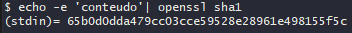

# Introdução ao Git e ao GitHub

Git e Github são duas coisas diferentes.

Git é um software que serve para controlar o versionamento de um projeto.

GitHub é uma plataforma para hospedar e facilitar a colaboração do software.

Em resumo, é utilizado o Git para receber e enviar ao GitHub projetos e alterações nos arquivos dos mesmos.

GUI = Graphical User Interface

CLI = Command Line Interface

Comandos do Git para navegação (utilizando Git Bash):

| Ação                        | Windows    | Unix         |
| --------------------------- | ---------- | ------------ |
| Mudar de diretórios         | cd         | cd           |
| Listar diretórios           | dir        | ls           |
| Criar arquivos/diretórios   | mkdir      | mkdir        |
| Excluir arquivos/diretórios | del /rmdir | *rm* ou *rf* |
| Limpar texto do terminal    | clear      |              |

## Como o GIT funciona por baixo dos panos?

### SHA1

Significa "Secure Hash Algorithm".

É um algorítmo de criptografia. A saída desse algorítmo é um conjunto de 40 caracteres.

Cada vez que é rodado o algorítmo em um arquivo, é gerada uma chave de 40 caracteres. Mesmo se mudar um ponto, uma letra, e for executado novamente, é gerado uma chave diferente.

É uma forma curta de representar um arquivo. Bastante importante com o uso do GIT.

Exemplo de SHA1 gerado:

]

Exemplos de retorno de SHA1

Arquivo original:

1de6ef1641d8d0578ec254277136a87ee029d747

SHA1 após digitar um número 4 no arquivo:

7a0be4d430fa86e16987f8638288d51e36fdf546

Se eu deixo o arquivo da mesma forma que antes, gera a mesma chave SHA1.

1de6ef1641d8d0578ec254277136a87ee029d747

Ou seja, cada modificação feita no arquivo, uma chave sha1 diferente.

## Tipos de Objetos no Git

### Blobs

A grosso modo, os blobs são as ''bolhas'', são objetos como se fossem pacotes de dados.

O Blob vai ter dentro dele os metadados, como o tipo do objeto, o tamanho da string, o SHA1, os caracteres ''\0'', e o texto em si.

Exemplo no console do Git (Git Bash):

echo 'conteudo' | git hash-object --stdin

Com o echo, estamos apontando para o console essa string 'conteudo'.

Com o comando git hash-object, estamos querendo transformar um arquivo em um objeto hash (parece que é como se fossemos gerar o sha1 daquele arquivo).

Porém esse comando hash-object tem esse parâmetro --stdin, pois essa função hash demanda um arquivo e então usamos esse parâmetro, como um ''parser'', para ''transformar'' essa string em arquivo para que esse comando o aceite e funcione.

O retorno acima ''fc31...'' é como se gerasse um SHA1 de retorno da string 'conteudo'.

Com esse comando do sha1, gera uma outra chave.

Por quê? Porque os arquivos dentro do Git ficam dentro de um ''Blob'' e nele há metadados, ou seja, são arquivos diferentes. Mas como gerar a mesma chave SHA1?

Dessa forma que ele vai transformar o blob em si, que contém a string 'conteudo' na SHA1 igual a que geramos usando o comando hash-object anteriormente.

### Trees

Trees armazenam os blobs e relacionamentos entre os blobs.

Além dos mesmos dados que os Blobs possuem, as Trees vão ter o nome do arquivo em questão. Podem também apontar para outras Trees. Os Blos NÃO armazenam o nome do arquivo em si.

A Tree que vai servir pra montar toda a estrutura de onde estão os arquivos no Git.

As Trees também têm SHA1 próprio. Ou seja, se mudar qualquer coisa relacionada a uma Tree, o SHA1 dela vai mudar.

Ou seja, tá tudo bem amarrado pra controlar versionamento.

Exemplo de uma hierarquia entre Trees e Blobs.

### Commit

Commit é o objeto que vai juntar tudo isso.

Nele vai ter a Tree, o commit parente - o último commit feito antes dele, o autor deste commit, a mensagem que o autor deseja informar sobre o motivo do commit e o timestamp (data/hora).

O SHA1 do commit é o hash de toda essa informação. Mesmo princípio de alteração das trees e blobs, se alterar alguma vírgula nas hierarquias anteriores, também vai mudar o SHA1 do commit.

Ou seja, serve pra controlar bem alterações de dados em um projeto. Tem como saber o autor, quando foi alterado, quais dados foram alterados, etc.

Exemplo visual da hierarquia entre os 3 elementos.

## Por que é um sistema distribuído?

Porque os dados são distribuídos de forma controlada e confiável entre inúmeros usuários que fazem parte daquele projeto. Num exemplo que ele citou, se há 40 pessoas contribuindo para um mesmo projeto, todas as versões de um projeto desde a atual até mesmo a mais antiga, estão acessíveis e íntegras. Se der algum problema catastrófico, o projeto teria de sumir das 40 pessoas para que seja perdido por completo, o que é praticamente impossível. Fora que não tem como editar um commit já feito, para isso teria que ser criado outro commit e os anterior ainda assim seria acessível.

A grosso modo, é como se a cada alteração do projeto, você mantivesse separadamente o histórico de tudo desde o início e também de como está o projeto após todas estas alterações.

## Chaves SSH e Tokens

O GitHub em Agosto de 2021, começou a não aceitar mais usuário e senha.

Chave SSH é uma forma de estabelecer conexão segura e encriptada entre duas máquinas.

Há a chave pública e a chave privada. A pública você atrela à sua conta no GitHub, e a privada você atrela ao client Git no seu computador usando o terminal do GitBash. Com isso, você não vai mais precisar digitar login e senha para dar commits dos seus projetos no GitHub.

Pra que digitar senha toda hora, se você pode gerar as duas chaves SSH, atrelar a chave pública ao GitHub e a privada ao Git no computador, e poder se autenticar automaticamente?

Comandos para gerar a chave SSH do computador, para ser possível autenticar no GitHub sem senha:

No GitBash:

ssh-keygen -t ed25519 -C endereco_de_email@email.com

Há uma outra forma de autenticação, que é o token de acesso pessoal.

Serve para apenas precisar digitar o login. No lugar da senha, você carrega o arquivo de token que você deixa armazenado no seu computador ou outro armazenamento.

O professor prefere mais usar a chave SSH, que fica automático, não fica pedindo senha. Usando o token, o GitHub vai pedir autenticação.

No site do Github de algum repositório qualquer, há links por HTTPS, SSH, entre outros, para que você consiga clonar o conteúdo do repositório para poder utilizar/editar os arquivos dele.

Usando esse token, você vai clonar pastas do github usando o protocolo HTTPS, não o SSH.

Usando chave SSH, você copia o link de clone do protocolo SSH e ele não pede login/senha nem nada, para baixar, ao contrário do uso do token.

Usariam token em casos de dispositivos ''airgap'''? Seria essa a forma mais segura, por teoricamente não precisar conter nada de chave em público?

Comandos para iniciar no Git e criar commits:

| Ação                                                       | Comando                                                               | Observações                                                                                                                        |
| ---------------------------------------------------------- | --------------------------------------------------------------------- | ---------------------------------------------------------------------------------------------------------------------------------- |
| Iniciar projeto no diretório atual                         | git init                                                              |                                                                                                                                    |
| Adicionar arquivos/pastas como "Staged"                    | git add                                                               | "git add *" por exemplo permite adicionar todo o conteúdo no diretório como "Staged".                                              |
| Dar commit no conteúdo que estava "Staged"                 | git commit -m "Texto informando sobre o commit"                       | Todo commit necessita de alguma mensagem, explicando resumidamente sobre o que está sendo "commitado".                             |
| Subir os commits para o GitHub                             | git push                                                              | "git push -u origin main" por exemplo dará push no repositório local para o repositório remoto de nome "origin", na branch "main". |
| Associar repositório remoto do GitHub ao repositório local | git remote add origin                                                 | Após o "origin", inserir a URL do repositório remoto.                                                                              |
| Atribuir email à configuração global do Git                | git config --global [user.email](http://user.email) "email@email.com" |                                                                                                                                    |
| Atribuir nome de usuário à configuração global do Git      | git config --global [user.name](http://user.name) Seu_Nome            |                                                                                                                                    |
| Ver status de repositório local                            | git status                                                            |                                                                                                                                    |

## Como dar commit?

Acessando o Git Bash, no diretório onde se encontram os arquivos a serem ''commitados'':

| Ação                                       | Commando                                        | Observações                                                                                            |
| ------------------------------------------ | ----------------------------------------------- | ------------------------------------------------------------------------------------------------------ |
| Adicionar arquivos/pastas como "Staged"    | git add                                         | "git add *" por exemplo permite adicionar todo o conteúdo no diretório como "Staged".                  |
| Dar commit no conteúdo que estava "Staged" | git commit -m "Texto informando sobre o commit" | Todo commit necessita de alguma mensagem, explicando resumidamente sobre o que está sendo "commitado". |

## Conceito sobre Tracked e Untracked

"Untracked" é quando é criado um novo arquivo por exemplo. Usando o comando "git add *", estamos passando de "Untracked" para "Staged".

Aqui abaixo, ficam as divisões entre os ambientes de desenvolvimento e o servidor do repositório remoto.

O processo para tornar os conteúdos do projeto como "Staged". Este processo é totalmente local. Não foi passado nada para o repositório remoto ainda.

O processo de commit torna o conteúdo de "Staged" de volta para "Unmodified", pronto para poder ser modificado novamente. Processo ainda local. Somente irá para o repositório remoto quando for realizado o "push" do repositório.

### Dúvidas para posteridade

Seria o status ''Staged'' um ''pré-salvamento'' do arquivo a ser commitado, para que seja feito o commit somente após todas as alterações de todos que estiverem colaborando para editar aquele arquivo?

Pelo que entendi, commitamos um arquivo, ele fica como Unmodified, então uma ou mais pessoas colaboram para aquele arquivo e após isso fica Modified. E aí então, após todas as modificações terem sido feitas, que seria marcado como ''Staged"?
