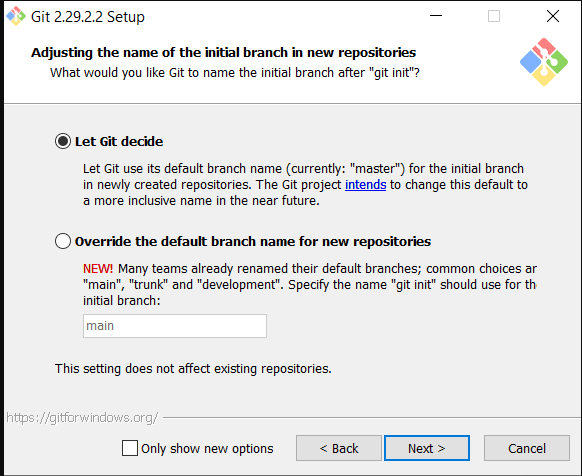
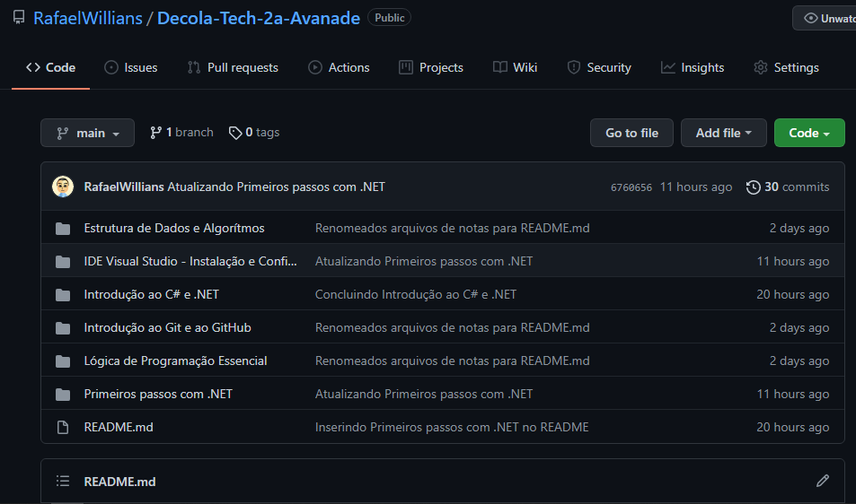
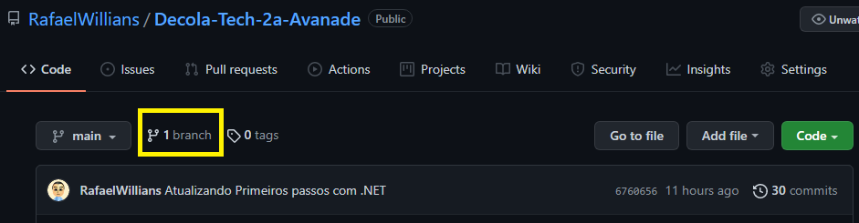
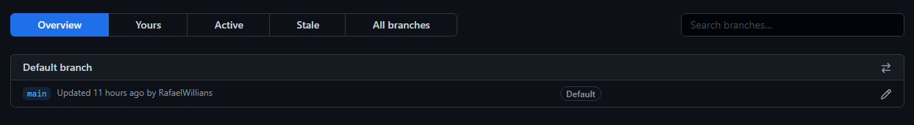
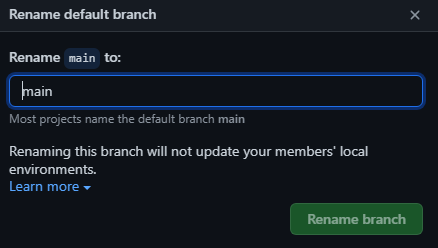

# Como alterar de "master" para "main" no Git/GitHub?

Olá, pessoal!

Durante as aulas de introdução ao Git/GitHub, tive dificuldade sobre essa questão de estar ''master'' no meu computador, mas ''main'' no site do GitHub e vi que tinha gente tendo essa dificuldade também. Então estou postando aqui para sanar essa dúvida.

Recentemente o GitHub mudou o nome padrão da branch, de ''master'' para ''main'', porém durante a instalação do Git, isso não fica claro pra quem tá começando, então podemos acabar deixando no padrão antigo.

Durante a instalação, basta marcar a opção mais abaixo (Override the default branch name for new repositories) e digitar a palavra "main".

Os repositórios existentes não vão ter os nomes alterados. Para isso você precisa alterá-los manualmente no Git e no site do GitHub.

Mas, e se já tivermos instalado o Git?

Se você quiser mudar o padrão para os próximos repositórios, abra o Git Bash e digite o seguinte comando:

**git config --global init.defaultBranch main**

Caso você já tenha criado o repositório e queira renomear tanto localmente, quanto no site GitHub, primeiramente acesse o seu repositório no GitHub.

Depois, clique no botão ''branch'' ou ''branches'' mais acima.

Depois, clique no lápis mais a direita, do nome que está como Default, digite "main" e clique em "Rename branch".

Depois disso, para renomear o repositório local, abra o Git Bash na pasta onde você criou esse repositório no seu computador e execute os seguintes comandos, trocando "nome_antigo" pelo nome que estava antes e "nome_novo" pelo nome novo:

**git branch -m nome_antigo nome_novo**

**git fetch origin**

**git branch -u origin/nome_novo nome_novo**

**git remote set-head origin -a**

E voilá!

Vou deixar alguns links aqui em baixo, caso queiram saber mais alguns detalhes sobre esse tipo de alteração.

Até mais!

Links:

[Renaming a Branch - GitHub](https://docs.github.com/pt/repositories/configuring-branches-and-merges-in-your-repository/managing-branches-in-your-repository/renaming-a-branch)

[How do I change the git default branch name for new repositories from master to main? - Cyberhelp Sesync](https://cyberhelp.sesync.org/faq/change-git-default-branch-name-from-master-to-main.html)
