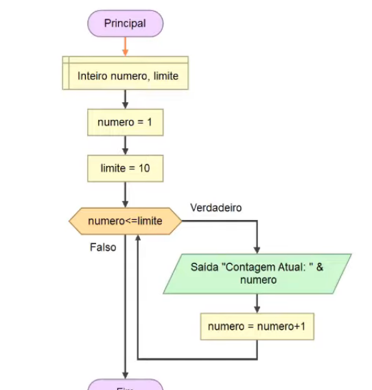
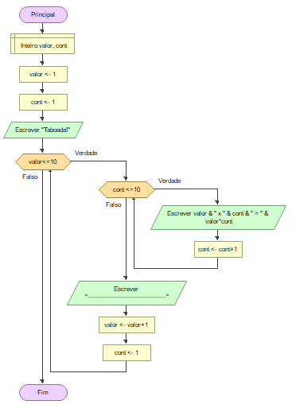

# Lógica de Programação Essencial

## Definições

Lógica = coerência de raciocínio, de ideias, sequência coerente, regular e necessária de acontecimentos, coisas, etc.

Metacognição = pensar como você pensa.

Abstração = focar no que realmente importa.

Exercício = só somar as 4 notas e depois dividir o resultado por 4

### Fluxograma, variáveis, constantes

* Fluxograma = ferramenta para representar visualmente um algorítmo. Um diagrama mostrando o fluxo de alguma coisa. Entrada, saída de dados, condições, etc.

* Variáveis = que ''vareiam''. Hehe. Vai reter valor, expressão, etc e pode ser modificado depois. Espaço na memória, destinado a um dado, que pode ser alterado durante a execução do algorítmo. 
  
  No pseudo-código:

        INÍCIO

        DECLARA nota1: número

        DECLARA nota2: número

* Tipos: numéricas, caracteres, alfanuméricas, lógicas.

* Constantes: imutáveis, não vão ser alterados durante a execução do programa. 
  
  No pseudo-código:

        INÍCIO

        DECLARA p=3,14

        ...

## Tomadas de decisão e expressões aritméticas:

Expressões literais: expressões com constantes ou variáveis que tem como resultado valores literais.

← : atribuição de valor para uma variável

O ''='' também é para atribuição de valor para uma variável ou constante.

Operadores relacionais: os operadores que retornam bool (verdadeiro ou falso). Ou seja, compara se a condição é verdadeira ou não, como por exemplo se a variável x é maior que 5, ou menor que 20.

''>'' : maior que

">=":  maior ou igual

''<'' menor que

''<='': menor ou igual

''=='': igualdade

''!='': diferente de

## Estrutura de repetição

Repetições, junto com tomadas de decisão, são 70% da programação. Serve para repetir os mesmos comandos de forma condicionada.

*Dica: No Flowgorithm, é possível concatenar texto com variável usanco o "&".*

Exercício - fazer taboada do 9 com loop.

]

Nesse fluxograma, já mostra a taboada toda sem precisar do input do usuário.

## Linguagens de programação e Portugol

Linguagem de Programação é uma linguagem escrita e formal pra gerar softwares.

Por mais que linguagens como VHDL e Verilog têm sintaxe que remetem a Linguagem de programação, aparentemente não são necessariamente definidos como linguagens de programação, mas Linguagens de Descrição de Hardware (apesar de terem estruturas bem similares).

"O que é óbvio para você, certamente não é óbvio para uma máquina. E se você quer que a máquina faça algo para você, você precisa 'falar com ela' (na mesma linguagem)."

O óbvio pra mim não é o óbvio pra eles. Hehehe.

Tipos de linguagens:

* Alto nível: sintaxe similar a linguagem humana, como C/C++, C#, VB, Java, etc.

* Baixo nível: mais próxima ao de máquina, como Assembly, Linguagem de máquina.
  
  

Compiladas: O código fonte é executado pelo SO/processador direto. C++, C#, Delphi, por exemplo, são compiladas.

Interpretadas: São executadas por software interpretador, para então ser executado pelo SO ou processador. Linguagens usadas em web browsers são interpretadas, como JavaScript, PHP, etc.

Portugol: pseudolinguagem pra desenvolver algorítmos usando o português, pra ficar mais fácil de entender o algorítmo. Professor recomendou o uso do Portugol Studio.

Nele, testei se tinha como fazer subrotinas. É possível, mas fui curiar e testar se havia como fazer mais de um retorno na mesma função.

Pesquisei e vi que no C# por exemplo, não é possível apenas dando o comando 'return', mas há formas de contornar isso, como retornar valores em um vetor.

No post abaixo, há mais informações sobre.

https://www.c-sharpcorner.com/UploadFile/9b86d4/how-to-return-multiple-values-from-a-function-in-C-Sharp/

## No Portugol Studio

Tipo de variável cadeia: cadeia de caracteres (string)

Para pular linha, basta colocar "\n" no texto. Exemplo: *escreva("\n")*

Sintaxe do loop ''for'' é igual a do C / C#.

### Exemplos de pseudocódigos no Portugol Studio

Case no Portugol Studio:

    int valor=0

    escolha (valor)

    {

        caso 1: escreva("OK! Abrir Netflix")

        pare

        caso 2: escreva("OK! Abrir Amazon Prime")

        pare

        caso 3: escreva("OK! Abrir HBO GO")

        pare

        caso 4: escreva("OK! Sair")

        pare

        caso contrario:

        escreva("Escolha uma opção válida!")

    }

#### Comentários no código

* Para múltiplas linhas:

        /*

        */

* Para única linha: 

        //

#### Loops

* Do While:

        faca

        {

            contador ++

        }enquanto(contador<=limite)

## Vetor e Matriz

Vetor:  uma dimensão só. Exemplo no pseudocódigo:

    cadeia frutas[4]

    frutas[0] = "Maçã"

Matriz: mais de uma dimensão. Exemplos no pseudocódigo:

* inteiro x[4][3] //matriz com 4 linhas e 3 colunas

* cadeia cesta [][]= {{"Maça", "100"},{"Pera", "200"}, {"Melao", "300"}}

* programa

        {

            funcao inicio()

            {

                cadeia cesta [][]= {{"Maça", "100"},{"Pera", "200"}, {"Melao", "300"}}

                escreva(cesta[0][0])

                escreva("\n")

                escreva(cesta[0][1])

                escreva("\n")

                escreva(cesta[1][0])

                escreva("\n")

                escreva(cesta[1][1])

                escreva("\n")

                escreva(cesta[2][0])

                escreva("\n")

                escreva(cesta[2][1])

            }

     }

No Portugol Studio, o primeiro índice de vetor/matriz também é zero.
