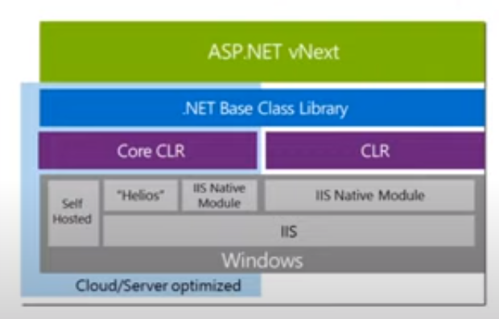
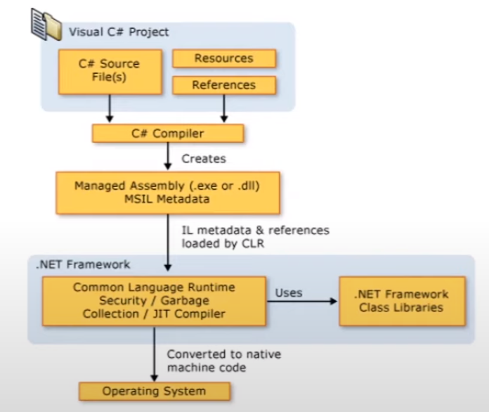

# Primeiros passos com .NET

## Passado, presente e futuro do .NET

Anos 70: Microsoft criou a linguagem de programação Basic.

Anos 80: é lançado o DOS, que é usado como OS padrão para os computadores IBM. 

Final anos 90 (1997): Microsoft tentou consolidar ferramentas de desenvolvimento com o Visual Studio 97 (Visual Basic 5, Visual FoxPro 5, C++ 5, J++).

1998: lançado Visual Studio 6, com as ferramentas Visual Basic 6, Visual FoxPro 6, C++ 6 e J++ 6.

1999: Scott Guthrie criou ASP+, ferramenta web com Java (depois chamado de ASP Next e depois ASPX). Nesse mesmo ano, Jason Zander ajudou a criar um common runtime para VB e C++ (CLR - Common Language Runtime).

Ainda nesse ano, a Sun Microsystems fez um acordo para a Microsoft não mexer mais com Java e então, Anders Hejlsberg começou a trabalhar no C#.

2000: é lançado o .NET 1.0, inicialmente com nome Next Generation Windows Services (NGWS).

2001: Miguel de Icaza começa a desenvolver o projeto Mono, uma reimplementação black box do .NET, sendo open source e multiplataforma. Ele NÃO trabalhava na Microsoft nesse momento.

2002: lançado Visual Studio .NET com C# 1.0, conhecido como 22 linguagens, 1 plataforma (C#.net, C++.net, VB.net, J#.net, etc).

2003: lançamento do .NET 1.1 com o Visual Studio 2003. Trabalham nas melhorias na CLR para lançar a CLR 2.

2005: lançamento do .NET 2.0 com C# 2.0 no Visual Studio 2005. Microsoft começa a atingir o objetivo inicial, além de evoluir na web.

2007-2008: lançamento do .NET 3.5 com C# 3.0 no Visual Studio 2008, com Silverlight, WPF e WCF. Microsoft contrata time voltado para open source, para criar o ASP.NET MVC. Inicia-se ideia do Windows Azure.

2010: lançamento do .NET 4.0, com C# 4.0 no Visual Studio 2010, também com F#. Além do lançamento do Windows Azure. Anders Hejlsberg começa a trabalhar no Typescript.

2011: Miguel de Icaza inicia o Xamarin. Começaram a criar em C# aplicativos que rodam em Android e iOS.

2012: .NET 4.5, com C# 5.0 no Visual Studio 2012. Lançamento também do Typescript.

2013: .NET 4.5.1 no Visual Studio 2013. Início do Roslyn, novo compilador para C# e VB.NET (este compilador foi desenvolvido em C# mesmo).

Microsoft continua atuando na frente JS e aumenta o uso de ferramentas open source ao ambiente Microsoft.

Até agora, o ASP.NET sendo mais consolidado com MVC, Web API e SignalR. Ainda assim, era tudo muito focado no Windows.

2014: Satya Nadella se torna CEO e direciona o foco da empresa para cloud. Criada a .NET Foundation, para gestão de projetos open source.

Windows Azure se torna Microsoft Azure. Introduzido conceito do ASP.NET vNext, depois chamado de ASP.NET Core.

2015: .NET 4.6 cp, C# 6.0 no VS 2015 e Visual Studio Code. O Code é open source e multiplataforma.

2016: Microsoft adquire a Xamarin e adiciona o produto como parte da stack .NET e projetos open source. Lançamento do Visual Studio for Mac.

Lançamento também do .NET Core 1.0, totalmente nova, open source e multiplataforma.

2017: Lançamento do .NET Framework 4.7 com C# 7.0 no VS 2017. Lançamento do .NET Core 2.0 com C# 7.0 no VS 2017, Visual Studio Code ou Visual Studio for Mac 2017.

2019: .NET Framework 4.8 com C# 7.3 no VS 2019 / .NET Core 3.0 com C# 8.0 no VS 2019, VS Code ou VS for Mac 2019.

2020: .NET Framework está pronto na versão 4.8, deixando de ser evoluído - junto com WCF e ASP.NET Webforms.

Agora só existe .NET 5, não mais .NET Framework.

.NET Framework é coisa do passado.

## O que é, como e onde usar .NET?

O .NET é uma infraestrutura para desenvolvimento de softwares, criada pela Microsoft. Uma aplicação .NET é desenvolvida usando uma das seguintes tecnologias:  .NET Core, .NET Framework, Mono ou UWP (Universal Windows Platform).

Ele serve para que múltiplas plataformas e múltiplas linguagens de programação podem usar toda uma gama de recursos em comum, para que possam ter as mesmas funcionalidades independente da plataforma que a aplicação será desenvolvida ou executada.

O conceito novo do .NET é ter o .NET Framework, .NET Core e Xamarin com suas distinções, porém as três compartilhando recursos através do .NET Standard Library, ou no slide mesmo, "uma única biblioteca para governar todos eles". E a partir dessa library unificada, então são utilizados os devidos compiladores, componentes de runtime e linguagens intermediárias ou de máquina.

Cada implementação abaixo inclui um ou mais .NET Runtimes (ambientes de execução):

- .NET Core: CoreCLR e CoreRT

- .NET Framework: CLR

- Mono: Mono Runtime

- UWP: .NET Native

Atualmente a Microsoft desenvolve e suporta 3 linguagens para .NET: C#, F# e VB.

## Preparando o ambiente

Instalação do [Visual Studio](https://visualstudio.microsoft.com/pt-br/downloads/) e [Visual Studio Code](https://code.visualstudio.com/) 

## Conhecendo a CLI do .NET

Executando "dotnet --help" no prompt dará uma lista com vários comandos possíveis do .NET.

Exemplos de comandos:

| Comando                               | Ação                                                                                                             | Exemplo de uso                          |                                                               |
| ------------------------------------- | ---------------------------------------------------------------------------------------------------------------- | --------------------------------------- | ------------------------------------------------------------- |
| dotnet --version                      | Traz a versão do .NET Instalado.                                                                                 |                                         |                                                               |
| dotnet --info                         | Traz a lista de todos os recursos instalados do .NET.                                                            |                                         |                                                               |
| dotnet new console                    | Criar projeto de aplicação console na pasta atual.                                                               | dotnet new console -n "Nome do projeto" | Criar com nome específico                                     |
| -h                                    | Parâmetro de ajuda, para saber mais sobre o comando digitado. Usar na mesma linha do comando, no final do mesmo. | dotnet new -h                           | Mostra quais tipos de projeto disponíveis para serem criados. |
| cd NomePasta                          | Abrirá o diretório informado.                                                                                    |                                         |                                                               |
| explorer .                            | Abrirá o Windows Explorer na pasta em questão.                                                                   |                                         |                                                               |
| code .                                | Abrirá o Visual Studio Code e nele, o conteúdo da pasta atual.                                                   |                                         |                                                               |
| dotnet restore                        | Restaura/baixa/atualiza os pacotes que o projeto da pasta em questão precisa utilizar.                           |                                         |                                                               |
| dotnet build                          | Faz todo o processo de compilação dos arquivos do projeto .NET da pasta em questão.                              |                                         |                                                               |
| dotnet run                            | Roda o executável do projeto em questão.                                                                         | dotnet run -p Caminhosubpasta/          | Roda o executável do projeto salvo no caminho informado.      |
| dotnet new console --framework net5.0 | Cria um novo projeto de aplicação console, na versão do .NET Framework 5.0                                       |                                         |                                                               |

## Criando uma aplicação console usando terminal do Windows (prompt ou mesmo o Git Bash)

Usando o comando acima "dotnet new console" na pasta que desejar criar o projeto. Para colocar um nome específico, tem o comando "dotnet new console -n "Nome do projeto"".

## Conhecendo o C#

### O que é C#?

É uma linguagem de programação orientada a objeto e fortemente tipada. Tem sintaxe similar a do C, C++ ou Java e suporta conceitos de encapsulamento, herança e polimorfismo.

Os programas são executados no .NET (CLR e conjunto unificado de libraries de classes).

O compilador atual é o Roslyn.

### Como funciona?

O código-fonte escrito no C# é compilado para a IL (linguagem intermediária). O código e os recursos do IL são salvos em disco em um executável chamado assembly, com a extensão .exe ou .dll.

Dúvida: seriam as dll's na verdade "executáveis" como os .exe são para nós, mas para os próprios .exe?

Quando o programa C# é executado, o assembly é carregado no CLR. Depois este executa a compilação JIT para transformar o IL em instruções de máquina.

Código em C# > IL > linguagem de máquina

O CLR tem outros recursos, como:

* Garbage Collector, para coletar o "lixo" da aplicação, liberando recurso não utilizado pela mesma;

* Exception Handler, que serve para controlar possíveis execuções com erro da aplicação;

* Resources Manager, ou gerenciador de recursos que a aplicação possa precisar.

O .NET também tem uma extensa biblioteca de classes, com diversas funcionalidades, desde manipulação de arquivos, caracteres, banco de dados, entre outros.

## Conhecendo variáveis e instruções

### Tipos de valor

Tipos de variáveis:

* Numéricos: sbyte, short, int, long, byte, ushort, uint, ulong

* Caracteres unicode: char

* Pontos flutuantes: float, double, decimal

* Booleano: bool

* Outros: enum, struct e tipos nullable (Exemplo: int?)

Variáveis de tipos de referência: armazenam referências a seus dados, não os dados em si. Em um local na memória, tem a variável com determinado valor, e em outro local na memória fica armazenada a variável de referência a este valor. Servem para armazenarem toda uma cadeia de dados, ou para a grosso modo, "trazerem" todo um bloco de dados para que o programa trabalhe com esses dados todos de uma forma melhor organizada, em algum momento. Pra que ficar digitando a criação de variável por variável no código, se podemos escrever no código de uma forma mais fácil, reutilizando esses mesmos recursos em vez de ficar criando na unha toda vez que fossem usadas?

Tipos de Referência:

* Tipos Classe: class, object, string

* Tipos Arrays: int[], int[,], etc...

* Outros: interface, delegate

### Instruções em programas

Há as expressões em bloco, com o símbolo de "{}". 

Há também da declaração de variáveis e constantes, usando os tipos acima.

Declarações de condições, como if, switch, while, do, for, foreach.

Outras instruções, como break, continue, return, throw, try .. catch .. finally, using.

### Exemplos de códigos

Exemplos disponíveis no GitHub do Gabriel: [GitHub - gabrielfaraday/csharp-examples](https://github.com/gabrielfaraday/csharp-examples.git)

## Classes e Objetos no C#

As classes são os tipos mais fundamentais do C#. São estruturas de dados que combinam estados (ou os campos) e ações (que são os métodos, as funções).

Objetos são instâncias de uma classe, a grosso modo como "uma cópia" editável da classe.

As classes podem ter herança e polimorfismo, que são derivações da classe que podem expandir ou especializar tais classes. Como por exemplo uma relação entre pai e filho (herança).

Exemplo para instanciar classe: "Ponto p1 - new Ponto(0,0);"

Há também os construtores, que servem para definir que tipos dados essa classe irá receber, e no caso de usar variáveis na classe, como esses dados que ela receberá serão armazenadas.

A memória que o objeto ocupa é recuperada automaticamente pelo Garbage Collector, quando não mais acessível. Não é necessário desalocar explicitamente os objetos no C#.

Os membros da classe (como constantes, variáveis, métodos, construtores, propriedades, etc.) podem ser estáticos (pertencentes a classe) ou membros da instância em si (percententes ao objeto).

Tipos de acessibilidade das classes: 

* public: qualquer parte do código pode acessar;

* protected: apenas classes herdadas podem ter tais classes;

* internal: somente acessível dentro do mesmo assembly que a classe faz parte;

* private: somente dentro daquela classe em questão;

* virtual: permite que uma classe filha sobrescreva suas ações;

* override: indica que irá sobrescrever a classe declarada como virtual anteriormente.

### Herança

quando se é declarada herança de uma classe, serão herdados todos os membros public, internal e protected da classe base.

Exemplo de declaração de herança: 

public class Ponto3D : Ponto

Exemplo de declarar construtor, herdando parâmetros da classe base: 

public Ponto3D(int x, int y, int z) : base(x, y)

 {

 this.z = z;

}

### Métodos

São membros que implementam uma computação ou ação que pode ser executada pelo objeto ou classe. Podem ou não receber parâmetros em valores ou referências de variáveis, e podem ou não retornar algum valor. 

Normalmente se declara um nome membro usando um verbo, por se tratar de alguma ação que aquela classe ou objeto fará.

### Exemplo de chamada por referência

No exemplo abaixo, é declarado o termo "ref" porque, se tirarmos esse "ref", o programa não vai inverter os dois números.

Esse "ref" indica que, conforme é executado o método "Inverter", iremos tanto receber o parâmetro em si da variável que passarmos por parâmetro ao chamá-lo, quanto alterarmos os valores dessas variáveis que foram passadas por parâmetro. Ou seja, com o "ref", iremos sim inverter os números normalmente.

public class Ref

 {

 static void Inverter(ref int x, ref int y)

 {

 int temp = x;

 x = y;

 y = temp;

 }

 public static void Inverter()

 {

 int i = 1, j = 2;

 Inverter(ref i, ref j);

 System.Console.WriteLine($"{i} {j}"); // Escreve "2 1"

 }

 }

Há também o uso de "out", que trabalha como o "return" de um método.

public class Out

 {

 static void Dividir(int x, int y, out int resultado, out int resto)

 {

 resultado = x / y;

 resto = x % y;

 }

 public static void Dividir()

 {

 Dividir(10, 3, out int resultado, out int resto);

 Console.WriteLine("{0} {1}", resultado, resto); // Escreve "3 1"

 }

 }

## Structs, Interfaces e Enums

Structs são estruturas que podem conter membros de dados e de ação, mas são tipos de valor e não requererm alocação de heap. São diferentes das classes.

Uma variável struct armazena diretamente os dados da estrutura, enquanto uma variável de um tipo de classe armazena a referência a um objeto na memória.

Não aceitam herança. São estruturas mais simples, pra armazenar dados diretamente, como números complexos, pontos de GPS, etc. Structs alocam menos memória.

Interfaces são como contratos para classes e structs. Pode conter métodos, propriedades, eventos e indexadores. Ela geralmente não implementa membros, mas pode implementar. Ela apenas fornece a sua "assinatura". Podem empregar herança múltipla.

interface IControl

{

    void Paint();

}

interface IListBox

{

    void SetText(string text);

}

interface IComboBox : ITextBox, IListBox 

//herdando tanto da ITextBox quanto da IListBox

{

}

Enums serve pra definir um conjunto de constantes nomeadas. É como se fosse um vetor de constantes só que, em vez de trabalharmos com valores numéricos em si ou índices, usamos o nome em si do item que estamos nos referindo.

enum Cor

{

    Vermelho,

    Verde,

    Azul

}

## Exemplos de códigos no C#

* Console.WriteLine($"MÉDIA GERAL: {mediaGeral}");

Escreve, pulando uma linha, no console o texto "MÉDIA GERAL: " e concatena o texto armazenado na variável mediaGeral. A cifra antes das aspas é necessária, para conseguir escrever o texto da variável no console.

* string opcaoUsuario = Console.ReadLine();

É uma atribuição de variável do tipo string, em que faremos com que o usuário consiga digitar um texto e esse texto vai ficar armazenado nessa variável opcaoUsuario. Fazemos essa atribuição no código, no momento que desejarmos que o usuário digite algo no programa.

* if(int.TryParse(Console.ReadLine(), out int nota))
  
   {
  
   aluno.Nota = nota;
  
   }
  
   else
  
   {
  
   throw new ArgumentException("O valor da nota precisa ser inteiro!");
  
   }

Esse trecho de código serve para que o usuário possa digitar algum número no console, do tipo inteiro, para por exemplo calcularmos uma nota a um aluno. A condição do "if" fará com que o usuário consiga digitar um texto e, por conta do TryParse, o programa vai tentar converter o que foi digitado para o tipo inteiro e vai atribuir essa conversão à variável nota.

Então, se der certo essa conversão, o nosso objeto aluno vai receber essa nota. Do contrário (conforme o else abaixo), vai retornar um erro informando que o valor precisa ser do tipo inteiro.

Para trabalharmos com string, não precisa de conversão.

## Referências

[GitHub - gabrielfaraday/csharp-examples]([GitHub - gabrielfaraday/csharp-examples](https://github.com/gabrielfaraday/csharp-examples.git))

[.NET Foundation](https://dotnetfoundation.org)

[How to: View assembly contents | Microsoft Docs](https://docs.microsoft.com/en-us/dotnet/standard/assembly/view-contents)

[Programação funcional: O que é? | Alura Cursos Online](https://www.alura.com.br/artigos/programacao-funcional-o-que-e?gclid=EAIaIQobChMIrKeW54zn9AIVBMDICh3-pQxDEAAYASAAEgJfW_D_BwE)

[Entenda a programação funcional em 12 minutos - YouTube](https://www.youtube.com/watch?v=BWFpUHPqh1g)

[Conemu](https://conemu.github.io/)

[Técnicos - EximiaCo](https://eximia.co/personas/tecnicos/)

[# Entenda finalmente a diferença entre struct e class — C#](https://medium.com/@alexandre.malavasi/entenda-finalmente-a-diferen%C3%A7a-entre-struct-e-class-c-db1e34a96d50)
