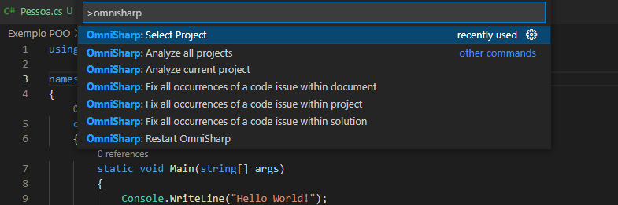
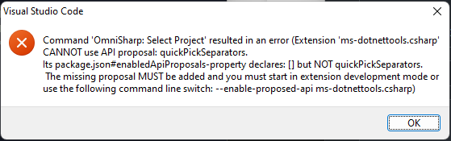
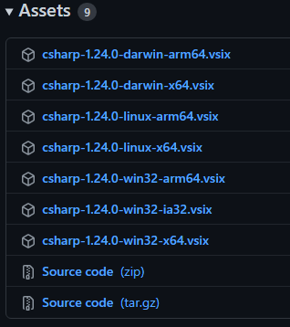
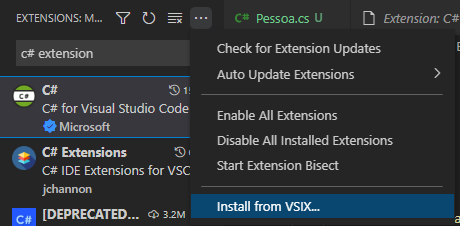

# VSCode - Como resolver erro na extensão OmniSharp

Olá, pessoal! 

No curso "Programando com Orientação a Objeto com C#", conhecemos uma extensão do Visual Studio Code e um dos recursos dessa extensão nos ajudará no preenchimento automático dos recursos do projeto, conforme digitamos o código. É o OmniSharp.

Para instalá-lo, basta ir em Extensions (ou digitar Ctrl+Shift+X) e digitar "C#" na pesquisa.

Digitando F1 no Visual Studio Code e digitando "omnisharp", deve aparecer conforme abaixo.

Porém, caso você esteja usando a versão 1.63 do Visual Studio Code, quando você tenta utilizar o comando "Select Project" do OmniSharp, é apresentada uma mensagem de erro como abaixo.

Como resolver isso? 

Você pode instalar a versão 1.62 ou anterior do Visual Studio Code e reinstalar a extensão, ou apenas instalar a versão beta da extensão manualmente.

Para a segunda opção, que eu testei na minha máquina, baixe através desse link: https://github.com/OmniSharp/omnisharp-vscode/releases/tag/v1.24.0-beta1

Se estiver no Windows por exemplo, baixe o arquivo "csharp-1.24.0-win32-x64.vsix" no final da página.

Depois, vá no Visual Studio Code, em Extensions, clique nos três pontos na parte acima da tela e depois em "Install from VSIX..." conforme abaixo. 

Selecione o arquivo vsix baixado, aguarde a instalação e, quando aparecer a notificação no rodapé, clique para reiniciar o Code e pronto! Você poderá adicionar o arquivo da solução, para reconhecer o autopreenchimento normalmente!

Qualquer dúvida, vou deixar também os links abaixo, das referências que li sobre esse caso.

Até mais!

Links:

[Stack Overflow - How to solve the problem that can't select project using Omni Sharp on VS Core?](https://stackoverflow.com/questions/70290626/how-to-solve-the-problem-that-cant-select-project-using-omni-sharp-on-vs-core)

[OmniSharp GitHub - Cannot select project with omnisharp because of quickPickSeparators](https://github.com/OmniSharp/omnisharp-vscode/issues/4907)

[OmniSharp GitHub - v1.24.0-beta1](https://github.com/OmniSharp/omnisharp-vscode/releases/tag/v1.24.0-beta1)

[Visual Studio Code - versões anteriores](https://code.visualstudio.com/docs/supporting/faq#_previous-release-versions)

[Visual Studio Code - versão 1.62.3](https://update.code.visualstudio.com/1.62.3/win32-x64-user/stable)