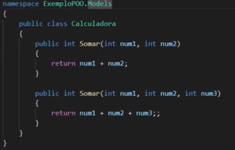
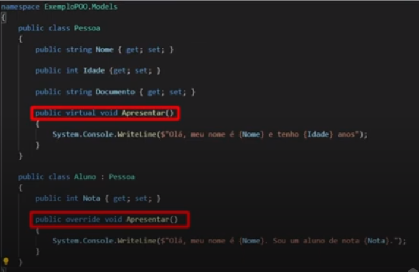

# Programando com Orientação a Objeto com C#

## Conhecendo POO

POO é uma técnica de programação para um fim específico.

Os 4 pilares da POO são: Abstração, Encapsulamento, Herança e Polimorfismo.

Estruturamos conjuntos de dados como objetos da vida real, em que cada objeto tem suas definições (atributos) e comportamentos (métodos).

Existem as classes (a estrutura base, o molde dos objetos) e os objetos (as variações ou "cópias" das classes).

Paradigma de programação é diferente de linguagem de programação. Uma linguagem pode implementar mais de um paradigma. O paradigma em si é a forma, o modelo, e/ou as regras que seguiremos, para desenvolvermos com aquela(s) linguagem(ns) de programação.

Exemplos de paradigmas de programação: POO, programação funcional, programação estruturada, imperativa, orientada a eventos, lógica, etc.

Exemplos de linguagens de programação: C#, Java, Javascript, etc.

## Abstração

### [* Artigo novo - como resolver erro na extensão OmniSharp, ao tentar selecionar projeto no Visual Studio Code mais recente](Fix%20para%20extens%C3%A3o%20OmniSharp/README.md)

Seria para abstrair um objeto para um contexto específico, considerando apenas alguns atributos.

Seria por exemplo utilizar no objeto apenas alguns atributos ou métodos específicos, definidos na classe. 

## Encapsulamento

Serve para proteger e limitar alteração de propriedades de uma classe, para expor somente o necessário.

Tipos de modificadores de acesso: public, protected internal, protected, internal, private protected, private. 

## Herança

Permite reutilizar código de uma classe em outras. Serve para agrupar objetos de mesmo tipo, mas com características diferentes.

Exemplo de uma pessoa. A pessoa tem uma mãe, essa pessoa herdará certas características da mãe, porém terá outras diferentes. Ou em outro exemplo, criando uma classe chamada Pessoa. As classes Aluno e Engenheiro, por exemplo, herdam características da Pessoa.

## Polimorfismo

Para sobrescrevermos métodos das classes filhas, para se comportarem de forma diferente da classe mãe.

Declaramos o mesmo nome do método, porém mudamos no código como o método vai se comportar na classe filha.

### Polimorfismo em tempo de compilação (Overload/Early Binding)

O nome é o mesmo, porém é alterada a assinatura do método (no exemplo abaixo, só muda que terá um parâmetro a mais e retornará a soma dele com os outros existentes)

### Polimorfirmo em tempo de execução (Override/Late Binding)

Declaramos uma propriedade "virtual" ao método da classe mãe, indicando que ela poderá ser sobrescrita, e "override" no método da classe filha, para sobrescrevermos o comportamento desse método nessa classe filha.

## Classes abstratas

## Interfaces

## Manipular arquivo

## Atalhos C#

Digitar ''cw'' = completa automaticamente no código com "System.Console.WriteLine();"

## Referências

[Programação Orientada a Objetos C#](https://docs.microsoft.com/pt-br/dotnet/csharp/fundamentals/tutorials/oop)

